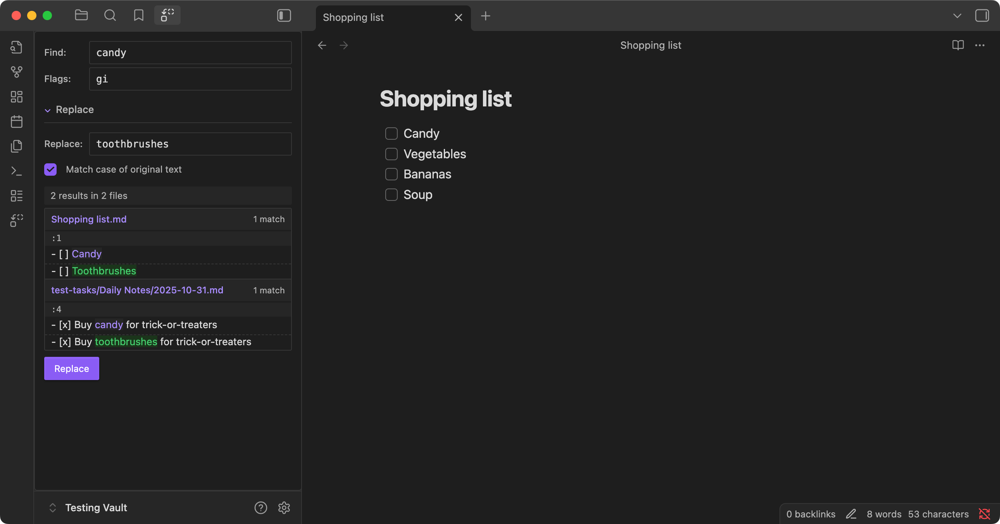

# Advanced Find and Replace Plugin for Obsidian

Find and replace text across your vault using regular expressions, with advanced features like capturing groups and a live preview.

## Features

-   **Regex Pattern Matching**: Use full regular expression support with flags (global, case-insensitive, etc.)
-   **Live Preview**: See exactly what changes will be made before applying them
-   **Vault-Wide Search**: Search across all markdown files in your vault simultaneously
-   **Before/After Display**: View the original text and replacement side by side
-   **Contextual Preview**: Shows surrounding lines for better understanding of changes

